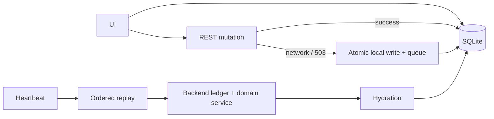

# Offline-Capable Apps

## Rules

- Admit offline behavior one domain at a time. Generated CRUD stays online-only.
- After storage is ready, render admitted data from SQLite.
- Keep service-worker `/api` requests `NetworkOnly`.
- Use permanent UUIDs and optimistic versions.
- Mutate the local row and enqueue its command in one SQLite transaction.
- Preserve command order. Do not compact create, update, or delete chains.
- Revalidate stable user ID and role before replay.
- Keep conflicts visible until the user retries or discards them.
- Never claim that memory or `localStorage` is durable production storage.

## Flow

SQLite is both the presentation source and the durable replay boundary.



## Boundary

The Template admits only Item operations.

```text
Offline: Item list, search, filters, sorting, paging, create, edit, delete
Online only: Item history, generated entities, first sign-in
```

Authenticated API responses stay out of Workbox caches.

```ts
runtimeCaching: [{ urlPattern: /\/api(?:\/|\?|$)/u, handler: "NetworkOnly" }];
```

## State

Use focused signals. Item rows remain in SQLite and TanStack Query.

```ts
export enum ConnectivityStatus {
  ONLINE = "ONLINE",
  OFFLINE = "OFFLINE",
}

export enum SyncStatus {
  IDLE = "IDLE",
  SYNCING = "SYNCING",
  BLOCKED = "BLOCKED",
}

export enum CacheStatus {
  UNAVAILABLE = "UNAVAILABLE",
  HYDRATING = "HYDRATING",
  READY = "READY",
  STALE = "STALE",
}
```

Signal files export signals only.

```ts
export const sigConnectivityStatus = signal(ConnectivityStatus.OFFLINE);
export const sigSyncSummary = signal(DEFAULT_SYNC_SUMMARY);
export const sigCacheReadiness = signal(DEFAULT_CACHE_READINESS);
export const sigOfflineSimulation = signal(DEFAULT_OFFLINE_SIMULATION);
```

## Identity

Expose a non-secret stable identity.

```java
public record AppCurrentUserResponse(UUID id, String username, String role) {
}

@GetMapping("/current-user")
@PreAuthorize(SecurityExpressions.IS_AUTHENTICATED)
public AppCurrentUserResponse currentUser() {
    return currentUser.require();
}
```

Cache only `id`, `username`, `role`, and `validatedAt`. The cached identity expires after 24 hours. Expiry locks access without deleting queued work. A different stable user ID purges the previous owner first.

## Local database

Keep cache, queue, and hydration state in one OPFS database.

```sql
CREATE TABLE items_cache (
  id TEXT PRIMARY KEY NOT NULL,
  version INTEGER NOT NULL,
  name TEXT NOT NULL,
  description TEXT NOT NULL,
  quantity INTEGER NOT NULL,
  status TEXT NOT NULL,
  pending INTEGER NOT NULL DEFAULT 0,
  conflict INTEGER NOT NULL DEFAULT 0,
  deleted INTEGER NOT NULL DEFAULT 0,
  keywords TEXT NOT NULL DEFAULT ''
);
```

Use a Worker runtime in production.

```ts
const runtime = createManagedSqliteRuntime({
  workerFactory: () => new Worker(new URL("./app-offline.worker.ts", import.meta.url), { type: "module" }),
  shouldUseInMemoryFallback: () => typeof Worker === "undefined",
});
```

OPFS failure produces an explicit online-only state. In-memory storage is for mocks and tests.

## Atomic queueing

Enforce the 1,000-command limit inside the mutation transaction.

```ts
const handlers = createSqliteRequestHandlers({
  applyItemMutation: (db, request) => {
    runSqliteTransaction(db, () => {
      assertQueueBelowLimit(db, 1_000);
      request.item ? itemBundle.upsertRow(db, request.item) : itemBundle.deleteRows(db, [request.itemId]);
      enqueueOfflineCommand(db, request.command);
    });
    return null;
  },
});
```

Use monotonic timestamps to preserve same-millisecond ordering.

## Mutation routing

Queue only while offline, during simulation, or after a network/`503` failure.

```ts
try {
  if (sigConnectivityStatus.value !== ConnectivityStatus.ONLINE || simulation.enabled) throw new Error();
  const created = await online.create(value);
  await cache.upsert(created);
  return created;
} catch (error) {
  if (!simulation.enabled && !isNetworkOr503(error)) throw error;
  const local = { ...value, version: 0, pending: true, conflict: false };
  await applyQueuedItemMutation(local, { method: "POST", url: "/api/items", body: value });
  return local;
}
```

Offline updates advance the local version but replay the previous expected version.

```ts
const local = { ...value, version: value.version + 1, pending: true };
await applyQueuedItemMutation(local, { method: "PUT", url: `/api/items/${value.id}`, body: value });
```

Offline deletes use an internal tombstone so hydration cannot resurrect the row.

```ts
await applyQueuedItemMutation(
  { ...cached, deleted: true, pending: true },
  { method: "DELETE", url: `/api/items/${cached.id}`, body: { version: cached.version } },
);
```

## Hydration

Fetch all pages, then replace the snapshot atomically.

```ts
for (let page = 0; ; page += 1) {
  const result = await online.search({ page, rowsPerPage: 100, sortBy: "name", sortDirection: "asc" }, emptyFilters);
  remoteItems.push(...result.content);
  if (page + 1 >= result.totalPages) break;
}
```

Pending rows, conflicts, and tombstones win over hydration.

```ts
const localChanges = new Map(localItems.filter(item => item.pending || item.conflict).map(item => [item.id, item]));
const merged = remoteItems.map(item => localChanges.get(item.id) ?? toCached(item));
```

Use one Web Lock around replay and hydration.

```ts
await navigator.locks.request("starter-template:offline-data", async () => {
  await replayQueuedItems();
  await hydrateItems();
});
```

## Replay

The backend reuses the same authorized domain service as REST.

```java
return switch (HttpMethod.valueOf(command.method())) {
    case POST -> replayCreate(command);
    case PUT -> replayUpdate(command, itemId(command.url()));
    case DELETE -> replayDelete(command, itemId(command.url()));
    default -> rejected(command, 422, "Invalid Item command.");
};
```

The server accepts at most 50 commands per request. The Template sends one at a time so a permanent failure is a strict barrier. Temporary failures use 1/2/4/8/16-second delays. Five failures become permanent.

```ts
const backoffMs = [1_000, 2_000, 4_000, 8_000, 16_000];
const commands = await queue.getBatch(1);
const response = await appAxios.post("/offline/sync", { commands });
```

The server ledger is per user, retained for 30 days, and capped at 10,000 records per partition. `ALREADY_APPLIED` is success. Permanent rejection blocks replay and marks the optimistic row `Conflict`. Rebase and retry reapplies local commands to current server versions with fresh command IDs; discard keeps server state.

## UI and lifecycle

- Expanded/mobile navigation: status dot, Online/Offline, sync state, count.
- Compact navigation: dot, badge, accessible tooltip.
- Settings: simulator, status, failure injection, local-wins rebase/retry, server-wins discard, reset.
- Disable Item mutations during hydration and replay.
- Disable Item history offline with an explanation.
- Show `Pending` and `Conflict` on Item rows.
- Confirm logout when queued or failed work exists.
- Reset clears cache, queue, failures, hydration state, and owner; it preserves preferences and an active online session.

## Limits

- Local Template data has no custom encryption layer; products must assess at-rest requirements.
- `USER` is read-only offline; `SUPERADMIN` may queue Item mutations.
- Cross-device merging and generated offline entities are not provided.
