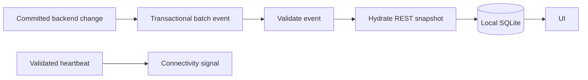

# Server-Sent Events

## Rules

- Use SSE for server-to-client invalidation, not as the application data store.
- A validated `heartbeat` is the only event that may mark the app online.
- Treat `batch` events as hydration triggers; fetch authoritative data afterward.
- Authenticate the stream and resolve an explicit audience for every connection.
- Validate every event before changing application state.
- Let native `EventSource` reconnect; repair missed data after the next heartbeat.
- Keep event payloads small: action, entity, stable ID, version, and revision.

## Flow

The stream carries liveness and invalidation; REST and SQLite carry domain data.



## Backend setup

Enable Vireo Offline and schedule its heartbeat publisher.

```groovy
dependencies {
    implementation "com.vireocode:vireo-offline"
}
```

Use a five-second heartbeat and bounded replay batches.

```properties
vireo.starter.offline.heartbeat-interval=5s
vireo.starter.offline.max-batch-size=50
```

Enable scheduling once in the application so heartbeats are published.

## Audience

Resolve an opaque audience from the authenticated reader.

```java
@Bean
OfflineSseAudienceResolver appOfflineSseAudienceResolver(AppCurrentUser currentUser) {
    return () -> currentUser.resolve()
            .filter(user -> user.role().equals("USER") || user.role().equals("SUPERADMIN"))
            .map(ignored -> "template-item-readers");
}
```

Use a tenant or organization key instead when readers must be isolated.

```java
return () -> currentUser.resolve().map(user -> user.tenantId().toString());
```

Never use usernames, cookies, bearer tokens, or raw authorization data as an audience.

## Event payload

Publish only the metadata needed to decide what must be refreshed.

```java
public record ItemSsePayload(UUID id, Long version) {
}
```

Narrow the generic change broadcaster before delegating to Vireo.

```java
@Bean
@Primary
OfflineChangeBroadcaster appOfflineChangeBroadcaster(OfflineHeartbeatService heartbeats) {
    return new ItemOnlyOfflineChangeBroadcaster(heartbeats);
}
```

Vireo emits named `heartbeat` and `batch` events.

A batch contains committed changes from one transaction.

```json
{
  "batchId": "a50d9017-9e64-4c34-929f-781d8a81f872",
  "events": [
    {
      "action": "update",
      "entity": "Item",
      "payload": { "id": "8cfaf299-b447-4697-a37b-5ec644970699", "version": 3 },
      "revision": 42
    }
  ]
}
```

## Frontend schemas

Reject malformed heartbeats instead of treating them as connectivity proof.

```ts
const Heartbeat = z.object({
  serverTime: z.string(),
  syncInProgress: z.boolean(),
});
```

Validate the admitted entity and action names in each batch.

```ts
const Batch = z.object({
  batchId: z.string(),
  events: z.array(
    z.object({
      action: z.enum(["create", "update", "delete"]),
      entity: z.literal("Item"),
      payload: z.object({ id: z.uuid(), version: z.number().nullable() }),
      revision: z.number().nullable(),
    }),
  ),
});
```

## Authenticated provider

Own the stream in one provider rendered only inside the authenticated application.

```tsx
useVireoEventSource({
  url: "/api/offline/heartbeat/stream",
  enabled: user !== null && !sigOfflineSimulation.value.enabled,
  withCredentials: true,
  listeners: {
    heartbeat: event => {
      Heartbeat.parse(JSON.parse(event.data));
      recordAppHeartbeat();
    },
    batch: event => {
      Batch.parse(JSON.parse(event.data));
      void hydrateOfflineItems();
    },
  },
  onListenerError: () => {
    // Invalid events do not advance heartbeat state or modify cached data.
  },
});
```

Do not set connectivity from `onOpen`, `onError`, `navigator.onLine`, or a successful REST call.

## Heartbeat state

Start offline and use the shared enum as the complete connectivity contract.

```ts
export enum ConnectivityStatus {
  ONLINE = "ONLINE",
  OFFLINE = "OFFLINE",
}
```

The signal file exports the signal only.

```ts
import { signal } from "@preact/signals-react";
import { ConnectivityStatus } from "../models/AppOffline";

export const sigConnectivityStatus = signal(ConnectivityStatus.OFFLINE);
```

A valid heartbeat marks the app online; twelve seconds without one marks it offline.

```ts
let lastHeartbeatAt = 0;

export function recordAppHeartbeat(receivedAt = Date.now()) {
  lastHeartbeatAt = receivedAt;
  if (!sigOfflineSimulation.value.enabled) {
    setConnectivityStatus(ConnectivityStatus.ONLINE);
  }
}

export function expireAppHeartbeat(now = Date.now(), maxAgeMs = 12_000) {
  if (sigOfflineSimulation.value.enabled || lastHeartbeatAt === 0 || now - lastHeartbeatAt > maxAgeMs) {
    setConnectivityStatus(ConnectivityStatus.OFFLINE);
  }
}
```

Initialize the expiry timer with other application-lifetime signal effects.

```ts
export function initSignalEffects() {
  const timer = window.setInterval(expireAppHeartbeat, 1_000);
  return () => window.clearInterval(timer);
}
```

## Reconnection

Every offline-to-online transition repairs gaps before normal work continues.

```ts
if (previous === ConnectivityStatus.OFFLINE && current === ConnectivityStatus.ONLINE) {
  await validateOfflineCurrentUser();
  await replayOfflineItems();
  await hydrateOfflineItems();
}
```

An SSE error may probe authentication, but a successful probe must not mark the app online.

```ts
onError: () => {
  void appAxios.get("/app/current-user").catch(error => {
    if (axios.isAxiosError(error) && error.response?.status === 401) {
      expireSession();
      void purgeOfflineData();
    }
  });
};
```

## UI

Show one calm status control in navigation.

Expanded and mobile navigation show the dot, label, sync state, and pending count. Compact navigation shows the dot and count badge with an accessible tooltip.

## Limits

- SSE delivery is not a durable message queue.
- A missed batch is repaired by hydration after the next heartbeat.
- The stream must never contain credentials or full sensitive records.
